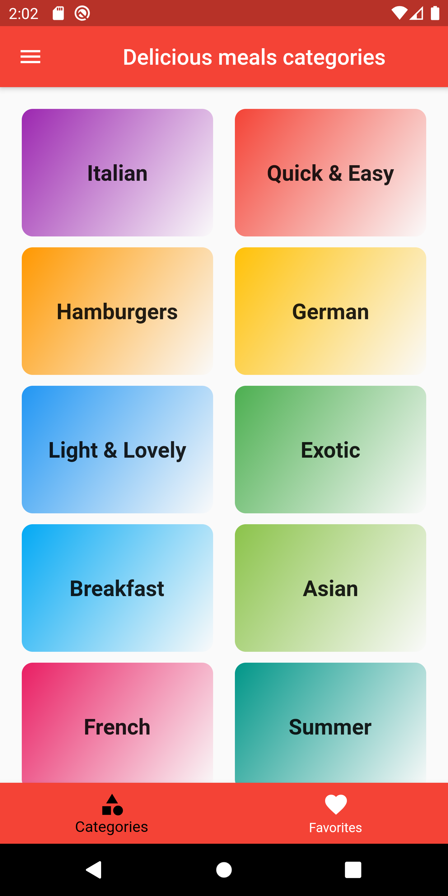
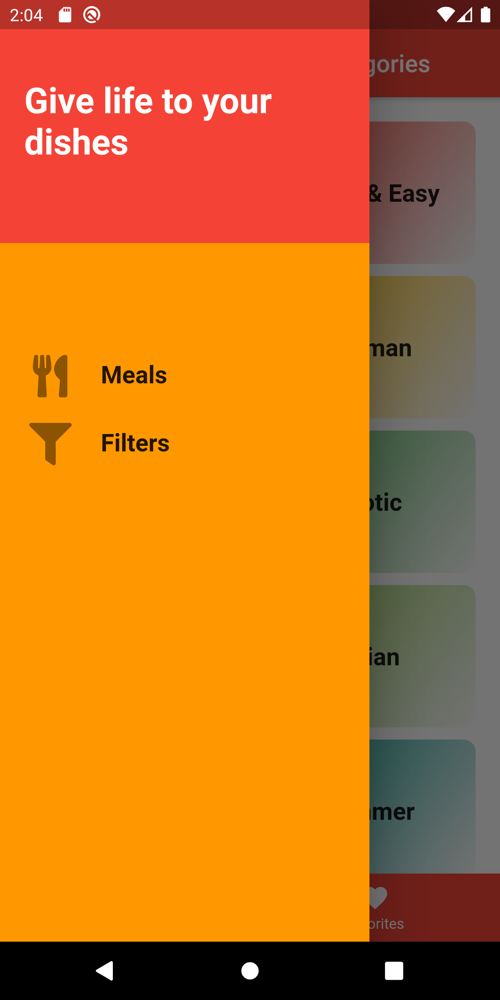
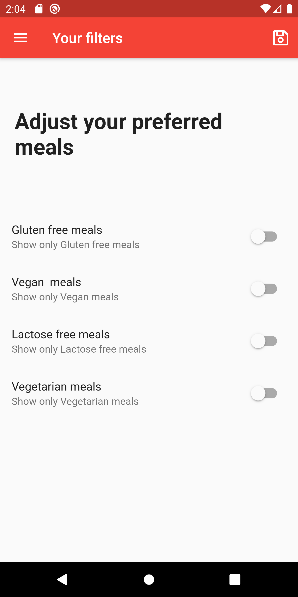
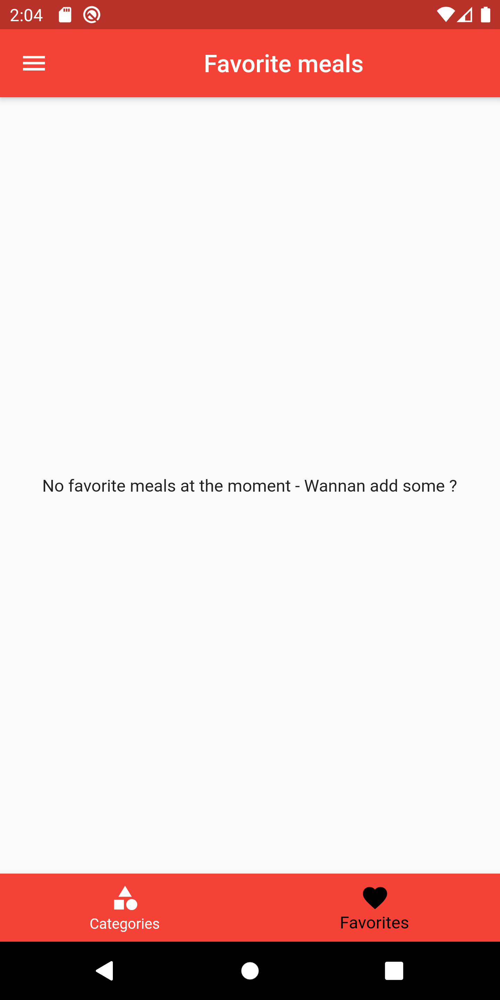
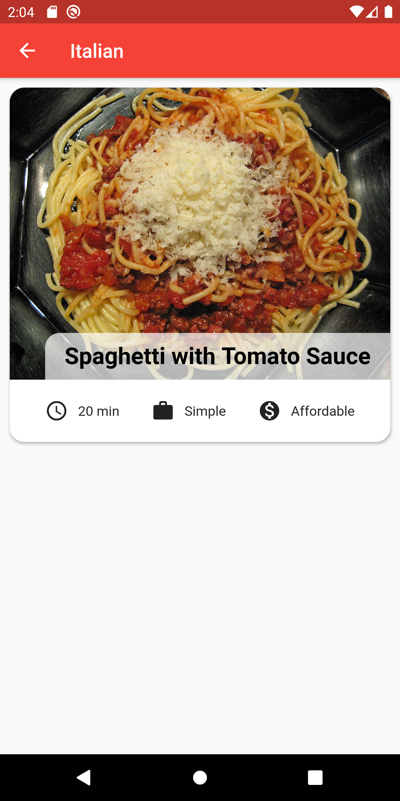

# ChatApp
<h3>Still under development ... </h3>

<div class="row">
  <div class="column">
    
    
    
     
  </div>
  <div class="column">
    
  </div>
</div>

meals management application using Flutter SDK


For help getting started with Flutter, view the online
[documentation](https://flutter.io/).


You can check out the corresponding Google code lab [here](https://codelabs.developers.google.com/codelabs/flutter/index.html?index=..%2F..%2Findex#0).
</p>

# Demo


## Getting Started
**Note:** Make sure your Flutter environment is setup.


#### Installation

In the command terminal, run the following commands:

    $ git clone https://github.com/SIMOHANNANI/DeliciousMealsApp.git
    $ cd DeliciousMealsApp/
    $ flutter run

# Simulate for Android(Not yet tested on MacOs)

    Make sure you have an Android emulator installed and running.
    Run the following command in your terminal.
    $ flutter run

##### Check out Flutter’s online [documentation](http://flutter.io/) for help getting start with your Flutter project.

# License

```
MIT License

Copyright (c) 2018 HANNANI Mohamed

Permission is hereby granted, free of charge, to any person obtaining a copy
of this software and associated documentation files (the "Software"), to deal
in the Software without restriction, including without limitation the rights
to use, copy, modify, merge, publish, distribute, sublicense, and/or sell
copies of the Software, and to permit persons to whom the Software is
furnished to do so, subject to the following conditions:

The above copyright notice and this permission notice shall be included in all
copies or substantial portions of the Software.

THE SOFTWARE IS PROVIDED "AS IS", WITHOUT WARRANTY OF ANY KIND, EXPRESS OR
IMPLIED, INCLUDING BUT NOT LIMITED TO THE WARRANTIES OF MERCHANTABILITY,
FITNESS FOR A PARTICULAR PURPOSE AND NONINFRINGEMENT. IN NO EVENT SHALL THE
AUTHORS OR COPYRIGHT HOLDERS BE LIABLE FOR ANY CLAIM, DAMAGES OR OTHER
LIABILITY, WHETHER IN AN ACTION OF CONTRACT, TORT OR OTHERWISE, ARISING FROM,
OUT OF OR IN CONNECTION WITH THE SOFTWARE OR THE USE OR OTHER DEALINGS IN THE
SOFTWARE.
```